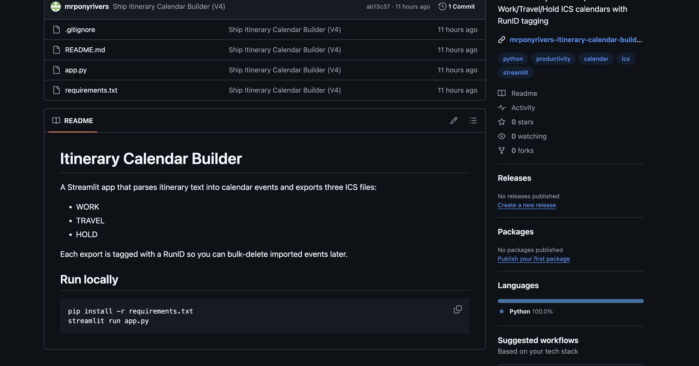
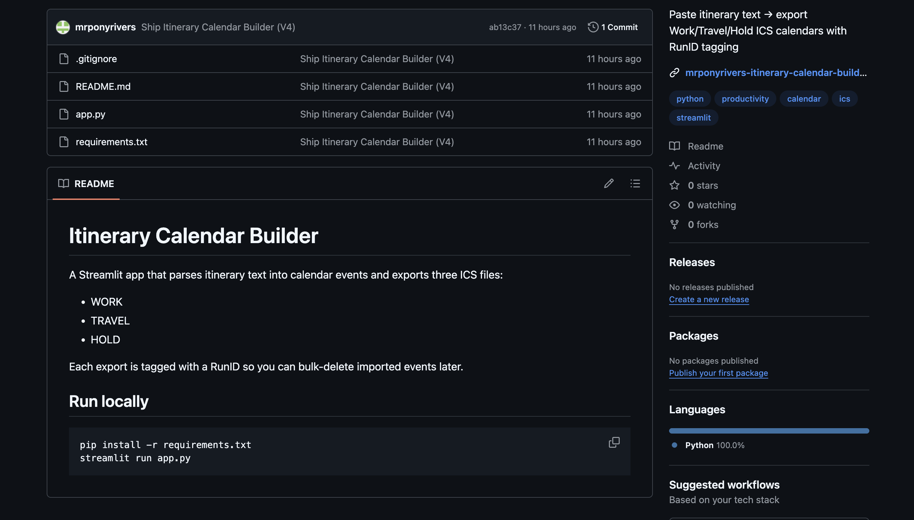

# Itinerary Calendar Builder

A Streamlit app that parses itinerary text into calendar events and exports three ICS files:
- WORK
- TRAVEL
- HOLD

Each export is tagged with a RunID so you can bulk-delete imported events later.

## Run locally

```bash
pip install -r requirements.txt
streamlit run app.py
```
```md
## Screenshots



